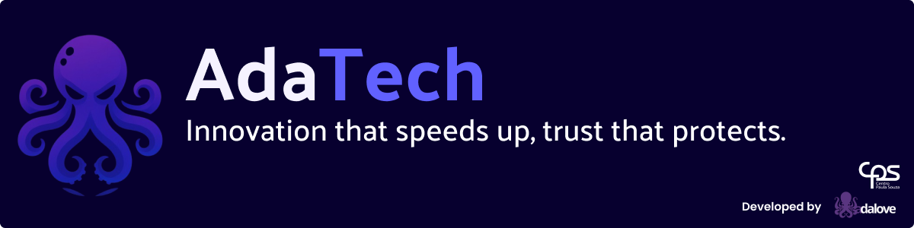
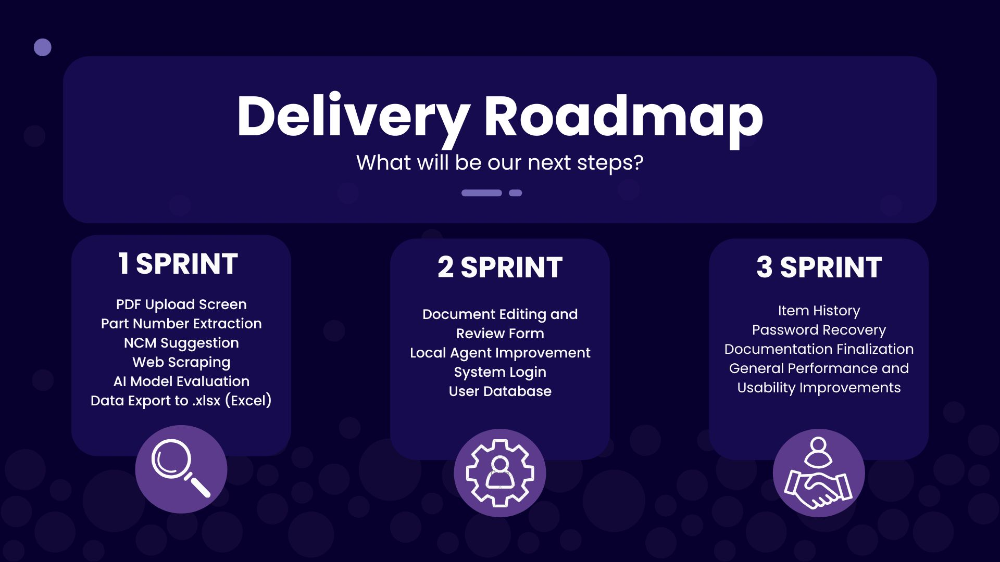

🌎 Read this in: [English](README.md) | [Português](README.pt-BR.md)

<a href ="#challenge"> Challenge</a> |
<a href ="#mvp"> Solution</a> |
<a href ="#backlog"> Product Backlog</a> |
<a href ="#sprint"> Sprint Timeline</a> |
<a href ="#prototype"> Application Prototype </a> |
<a href ="#technologies"> Technologies </a> |
<a href ="#demo"> Software Demonstration </a> |
<a href ="#dor"> DoR</a> |
<a href ="#dod"> DoD</a> |
<a href ="#roadmap"> Delivery Roadmap </a> |
<a href ="#manual"> Documentation Guide</a> |
<a href ="#adateam"> Team </a>
|

 

> Project Status: Completed ✔️

 

## 🏁 Challenge: 

The challenge consists of creating an innovative **Artificial Intelligence agent** capable of automating the preparation of customs registration instructions, intelligently incorporating critical data such as Part Number, fiscal classification, manufacturer, country of origin, and manufacturer address.  
The manual process of preparing these instructions is often prone to human error and rework, which can generate risks and consume a significant amount of time from the responsible team.  
The proposed solution aims to eliminate these inefficiencies, ensuring that material descriptions are accurate, unambiguous, and fully compliant with legal requirements.  
As a result, the Brazilian Federal Revenue Service can clearly understand the product, avoiding inquiries, penalties, or fines.

## 🫧 MVP (Minimal Viable Product) 

The solution to this challenge is <b>AdaTech</b>, an innovative platform that automates the creation of customs registration instructions, delivering a frictionless and highly accurate experience.  
The system efficiently integrates essential data such as Part Number, fiscal classification, manufacturer, and origin to automatically generate a product description that is both clear and legally compliant.  
What previously required time, focus, and carried a high risk of interpretation errors is now done quickly and in full compliance.  
This not only minimizes the risk of penalties but also allows the team to focus on higher value-added tasks, accelerating the process and increasing security in customs transactions.

## 🐙 Backlog do Produto

| Rank | Priority | User Story | Story Points | Sprint | Status |
| :--: | :------: | :--------- | :----------: | :----: | :----: |
| 1 | High | As an end user, I want to upload a purchase order PDF so the system can extract all Part Numbers (P/Ns) contained in it. | 5 | 1 | ✔️ |
| 2 | High | As an end user, I want the system to suggest the NCM code and description for each item so I can review them. | 13 | 1 | ✔️ |
| 3 | High | As an end user, I want to generate an Excel file with the final data to submit to the Federal Revenue Service. | 3 | 1 | ✔️ |
| 4 | Medium | As an end user, I want a form to review and correct the extracted information before finalizing the process to avoid errors. | 8 | 2 | ✔️ |
| 5 | Medium | As an end user, I want to access the system through a login screen to ensure company data security. | 5 | 2 | ✔️ |
| 6 | Medium | As an end user, I want access to a history of processed PDFs so I can quickly consult previous results. | 5 | 3 | ✔️ |
| 7 | Low | As an end user, I want access to complete system documentation to facilitate usage and installation. | 3 | 3 | ✔️ |

## 🚣 DoR - Definition of Ready 

✔️ Clear and Concise Description: The user story has a clear and concise description from the user’s perspective.  
✔️ Defined Acceptance Criteria: Acceptance criteria are clearly defined and understood by the team.  
✔️ Completed Estimation: The story has been estimated by the development team.  
✔️ Identified Dependencies: Dependencies with other stories have been identified.  
✔️ Product Owner Prioritization: The Product Owner has approved and prioritized all stories.

## 🏝️ DoD - Definition of Done 

- Code Written and Reviewed  
- Developer Testing Completed  
- Acceptance Criteria Met  
- Documentation Updated  
- Product Owner Approval  
- Code Merged into the Main Branch  

---

## 📅 Sprint Timeline 

| Sprint | Period | Report |
| ------ | :----: | ------ |
| ✔️ **SPRINT 1** | 09/08 – 09/28 | [Completed](docs/doc-sprints/sprint-1.md) |
| ✔️ **SPRINT 2** | 10/06 – 10/26 | [Completed](docs/doc-sprints/sprint-2.md) |
| ✔️ **SPRINT 3** | 11/03 – 11/23 | [Completed](docs/doc-sprints/sprint-3.md) |

## ✨ Application Prototype 

<table>
  <tr>
      <th>  </th>
      <th>  </th>
      <th>  </th>
      <th>  </th>
  </tr>
  <tr>
      <td> </td>
      <td>  </td>
      <td>  </td>
      <td>  </td>
  </tr>
</table>

## 🎥 Software Demonstration

### Sprint 1:

https://github.com/user-attachments/assets/a9756ad1-3aa7-4b0e-b4b7-896c7c4366f2

---

### Sprint 2:

https://github.com/user-attachments/assets/30c215c2-ef31-4997-841f-0ba3d7e6866e

---

### Sprint 3:

https://github.com/user-attachments/assets/382b0799-d370-4754-acb5-068a4deda1cc

---

## 🚢 Technologies

</h4>

## 🌊 Delivery Roadmap 

## 📖 Documentation Guide 

[User Guides in PT-BR (Installation and Usage Manual)](docs/manuais)  
[Technical Documentation in PT-BR](docs/documentacao)

## 🫧 AdaTeam

|        Membro         |    Função     |                                                                          Github                                                                          |                                                                                         Linkedin                                                                                          |
| :-------------------: | :-----------: | :------------------------------------------------------------------------------------------------------------------------------------------------------: | :---------------------------------------------------------------------------------------------------------------------------------------------------------------------------------------: |
|   Raphaela Monteiro   | Scrum Master  |  |                     |
|   Angelina Borroni    | Product Owner |         |  |
|    Matheus Germano    |   Dev Team    |         |                                                                  |
| Maria Fernanda Hansen |   Dev Team    |           |       |
| Ramon Amorim da Silva |   Dev Team    |        |                                      |
|     Renan Tomasi      |   Dev Team    |        |                                                                  |

## ⚓ Client 

|     Cliente      |                                                       |
| :--------------: | :---------------------------------------------------: |
| Creonice Honório | <a href='https://www.tecsysbrasil.com.br'>TecSys </a> |

## 🌊 Faculty Advisors 

|                                   P²                                   |                                   M²                                   |
| :--------------------------------------------------------------------: | :--------------------------------------------------------------------: |
| <a href='http://lattes.cnpq.br/1506784529918492'>Juliana Pasquini </a> | <a href='http://lattes.cnpq.br/4377240827813491'>Giuliano Bertoti </a> |

